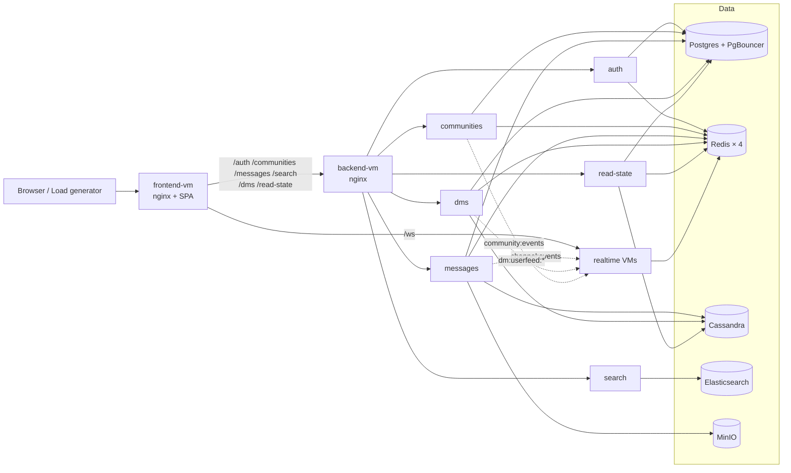

# CSE 356 — Discord-style Messaging System

A multi-service, real-time messaging platform (Discord clone): users, communities (guilds), channels, direct/group messages, presence, search, attachments, and infinite-scroll history. Built as a TypeScript monorepo, deployed across 11 VMs behind nginx, fronted by a Vite + React 18 SPA.

This README covers the six sections required by the course rubric. Deeper material lives in the linked docs.

| Section | |
|---------|---|
| 1. [Project Overview](#1-project-overview) | What the system does, components, how they interact |
| 2. [Running the System](#2-running-the-system) | Prereqs, env, build, start/stop, test |
| 3. [Scaling and Load Handling](#3-scaling-and-load-handling) | Bottlenecks, evidence, fixes, tradeoffs |
| 4. [Design Decisions](#4-design-decisions) | Storage, caching, concurrency, delivery, fault tolerance |
| 5. [Developer Guide](#5-developer-guide) | Repo layout, adding features, debugging |
| 6. [Team Process and Contributions](#6-team-process-and-contributions) | See [TEAM.md](./TEAM.md) |

Companion docs: [ARCHITECTURE.md](./docs/ARCHITECTURE.md) · [SCALING.md](./docs/SCALING.md) · [TESTING.md](./docs/TESTING.md) · [DEPLOYMENT.md (PROD-SPLIT-NGINX.md)](./docs/PROD-SPLIT-NGINX.md) · [TEAM.md](./TEAM.md) · [docs index](./docs/README.md).

---

## 1. Project Overview

Real-time text messaging server modelled on Discord. Users register or sign in (local + OAuth: Google, GitHub, course OIDC), join communities, chat in public/private channels, send DMs (1:1 + group) with image attachments, search history, and see live presence.

### Components

| Layer | Implementation |
|-------|----------------|
| **Client** | React 18 + Vite + Tailwind SPA (`frontend/`) |
| **Edge** | nginx (TLS + path routing) on a frontend VM |
| **Microservices** | 7 Node + Express + TypeScript services: auth, communities, messages, search, realtime, dms, read-state |
| **Postgres + PgBouncer** | Users, identities, communities, channels, memberships (Drizzle ORM) |
| **Cassandra** | Channel + DM message history (partition by `channel_id` / `conversation_id`) |
| **Redis** | 4 single-threaded instances on a dedicated VM — sessions, pub-sub, cache |
| **Elasticsearch** | Message search + community directory projection |
| **MinIO** | Image attachments via presigned PUT/GET |
| **Realtime** | WebSocket `/ws` fan-out, scaled across two VMs |
| **Monitoring** | Zabbix agent2 on every VM, per-port Redis plugins |
| **Deploy** | Ansible playbook over ~11 VMs |

### How it fits together



Services talk to clients over HTTP (REST) and to each other over Redis pub-sub (`channel:events`, `dm:userfeed:{0..19}`, `community:events`, `presence:broadcast`). Cassandra is the durable record for messages; Postgres for membership; ES is a projection.

Full topology, sharding, schema: [docs/ARCHITECTURE.md](./docs/ARCHITECTURE.md), [docs/sharding-and-replication.md](./docs/sharding-and-replication.md).

---

## 2. Running the System

### Dependencies

- Node.js 18+ (npm workspaces)
- Docker + Docker Compose (Postgres, Redis, Elasticsearch, MinIO, Cassandra)
- Ansible ≥ 2.15 (deploy only) · k6 (optional, load tests)

### Configuration

```bash
cp .env.example .env                       # local dev
cp docs/env.staging.example .env.staging   # talk to live infra
```

Each service reads a typed env (zod). The vars that matter most: `DATABASE_URL` / `DATABASE_URL_DIRECT` (PgBouncer + direct), the four `*_REDIS_URL` vars (`REDIS_URL`, `META_REDIS_URL`, `KV_REDIS_URL`, `KV_CACHE_REDIS_URL`), `CASSANDRA_CONTACT_POINTS`, `ELASTICSEARCH_URL`, `MINIO_*`, and `LOG_LEVEL`. Locally all Redis URLs can point at one container; staging/prod splits them across the four instances.

### Build, run, test

```bash
docker compose up -d              # data plane
npm install
npm run db:migrate
npm run dev:all                   # all 7 services + frontend → http://localhost:5173

npm run test:api                  # API suite vs staging
npm run test:trace                # WebSocket trace vs staging
npm run k6:routes                 # k6 smoke
```

Stop with `Ctrl-C`; `docker compose down` for the data plane. Hybrid dev (one service local, rest on staging) is documented in [docs/LOCAL-DEV.md](./docs/LOCAL-DEV.md).

### Deployment

Staging deploys via GitHub Actions on merge to `main-dev`, running the Ansible playbook (`ansible/playbooks/site.yml`) against the inventory. Production runs across ~11 VMs (frontend, backend nginx, one per microservice, two realtime, plus dedicated Postgres/Redis/Cassandra/Elasticsearch/MinIO VMs) on a private `10.0.0.0/8` subnet. Public hostname `group-6.cse356.compas.cs.stonybrook.edu` points at the frontend VM.

Runbooks: [docs/STAGING-ROLLOUT.md](./docs/STAGING-ROLLOUT.md), [docs/PROD-SPLIT-NGINX.md](./docs/PROD-SPLIT-NGINX.md).

---

## 3. Scaling and Load Handling

We load-tested with the course load generator (concurrent WebSocket clients pushing channel + DM traffic, plus search and presence). Each round we measured, fixed the headline bottleneck, redeployed, and ran again. Below is the high-level summary; per-bottleneck evidence (commandstats, slowlog, RT spans, load-generator errors) lives in [docs/SCALING.md](./docs/SCALING.md).

### 3.1 From one backend VM to a service-per-VM split

The first deploy ran every Node service on one backend VM. CPU on that VM saturated long before any single service was the obvious culprit. The fix was structural, not algorithmic: we moved each service to its own VM and put nginx in front of them.

End state: dedicated VMs for **auth**, **communities**, **messages**, **dms**, **read-state**, **search**, plus two **realtime** VMs, dedicated VMs for **Redis**, **Postgres**, **Cassandra**, **Elasticsearch**, and **MinIO**. Ansible (`ansible/playbooks/site.yml`) drives the rollout so any service can be moved or duplicated by editing inventory.

**Why it helped.** A noisy service (e.g. messages doing Cassandra writes during a burst) no longer steals CPU from auth or realtime. Each VM can be sized independently; e.g. the messages VM was given more cores than the auth VM.

### 3.2 Realtime fan-out — the hottest path

Realtime carries every message and every presence change. Three separate bottlenecks surfaced here in turn:

- **O(n) WebSocket fan-out.** Every Redis pub-sub event walked the full local connection map (~9 000 sockets at peak). Replaced with per-channel/guild target sets so each event touches only subscribers of that resource.
- **SMEMBERS hot key on `presence:channel:*` / `presence:guild:*`.** `INFO commandstats` showed 320k calls / 366 µs avg on one Redis instance; `--bigkeys` flagged a 1 521-member set. Added a 2 s in-process cache with inflight-request dedupe so a hot channel collapses to one Redis round-trip every 2 s instead of one per event. Also replaced `SCAN MATCH presence:conns:*` with a maintained `presence:conns:index` set.
- **Sharded DM pub-sub.** Single `dm:events` channel meant every realtime instance saw every DM. Moved to 20 `dm:userfeed:{shard}` channels keyed by userId; instances still subscribe all 20 but only deliver to locally-connected users — bounds per-instance fan-out cost.

Two realtime VMs sit behind nginx round-robin; cross-instance presence flows over `presence:broadcast` on the meta-pubsub Redis.

### 3.3 Redis: one instance → four, dedicated VM, vertical scale

Redis is single-threaded, so a single instance saturates one core regardless of how many cores the VM has. We:

1. Moved Redis off the backend VM onto its own VM.
2. Split into **four** `redis-server` instances on different ports — `pubsub:6379`, `kv:6380`, `pubsub2:6381`, `kv2:6382` — each pinned to its own core. Sessions never queue behind pub-sub; cache traffic never queues behind sessions.
3. Resized the VM 4 vCPU → 8 vCPU once the four cores were saturating, leaving headroom to add a fifth instance (e.g. dedicated `presence`) without reshuffling.

**Why it helped.** Aggregate Redis-VM CPU had looked healthy because it was averaged across cores while one core was at 100%. The split made each workload visible and serialise-able only against its own peers.

### 3.4 Database hot paths

- **Read-state cache.** Cassandra reads dominated the read-state service under load. Added a Redis read-through cache (`rs:latest:ch:*`, `rs:cs:*`, `rs:ds:*`, `rs:mc:*`) with batched MGETs, plus a Redis cache for `assertChannelAccess`. Cut Cassandra reads by ~70 %.
- **Postgres connection pooling.** Cluster-mode workers + 7 services × N connections each blew past Postgres's connection limit. Added **PgBouncer** in front of Postgres; clients reconnect to the pooler, not the DB.
- **Indexes for hot queries.** Added composite indexes on `community_members`, `channel_members`, `dm_participants`, and the directory ILIKE path. 20–100× speed-ups on the affected queries.
- **Search → Elasticsearch.** The community directory originally used Postgres trigram + ILIKE. Replaced with an ES projection populated from Postgres on startup and live `community:events`. The SPA's `/search-communities` became a thin BFF over ES with a Redis epoch-cache (`comm:e:*`, `comm:c:*`).

### 3.5 DM delivery reliability

DM tests intermittently reported `Delivery timeout`. Layered fixes:

- **Per-socket outbound queue** drained via `setImmediate`; the socket is killed on backpressure (>512 queued or >1 MB buffered) so a slow consumer can't stall fan-out.
- **Synchronous dead-socket eviction** on `ws.send` failure — remove from local maps immediately instead of waiting for the heartbeat to notice.
- **Cassandra replay on reconnect** using a `disconnectedAt` window per conversation, so the client catches up without per-conversation cursor state.
- **Server-side dedup** (last 512 message IDs per connection) so the parallel pub-sub + direct-HTTP fan-out paths don't double-deliver.
- **Pending queue** (`dm:pending:{userId}`, capped, 2 h TTL) bridges the reconnect gap before Cassandra replay catches up.
- **Direct HTTP fan-out** between `dms` and `realtime` via the instance registry — used in addition to pub-sub to cut the live-delivery race when the recipient is on a known instance.

### 3.6 Concurrency

- **Cluster mode** on multi-core VMs (auth, communities, messages) forks one worker per CPU core.
- **Realtime stays single-process per instance** — fan-out is I/O-bound and we scale by adding instances/VMs, not workers (workers would compete on the in-process connection map and presence cache).
- **WebSocket heartbeat** keeps idle connections from silent disconnect and lets the server detect dead sockets within a bounded window.

### 3.7 Monitoring loop

We couldn't fix what we couldn't see. Zabbix agent2 runs on every VM with the built-in Redis plugin configured per port, plus per-service systemd liveness checks. Triggers alarm on memory pressure, slowlog growth, blocked clients, and process death (see [docs/zabbix-redis-monitoring.md](./docs/zabbix-redis-monitoring.md)). Critical because aggregate-VM-CPU triggers alone hide single-core saturation — exactly the failure mode that masked the Redis bottleneck on the first load test.

### 3.8 Tradeoffs and what we did not solve

- **No HA on data stores.** Single-primary Postgres, single Redis VM, single Elasticsearch node. Replication topology is sketched in [docs/sharding-and-replication.md](./docs/sharding-and-replication.md) but not deployed.
- **No durable broker.** Async events go over Redis pub-sub. Loss-on-restart is acceptable because Cassandra is the durable record and DM reconnect performs replay; would matter for guaranteed-once cross-region delivery.
- **2 s presence cache window** can mean a freshly-joined user misses one fan-out tick — invisible to real users, and a deliberate trade for the ~100× SMEMBERS reduction.
- **Postgres sharding** is designed but not implemented; per-channel write load already lives on Cassandra so it wasn't the binding constraint.

---

## 4. Design Decisions

**Storage.** Postgres for identity / communities / channels / membership (ACID, low row count, easy Drizzle migrations). Cassandra for channel + DM history (append-only, partitioned, scales without app-level sharding). Elasticsearch for full-text + directory search (Postgres `LIKE` doesn't fit). MinIO for attachments via presigned URLs (binary stays off the JSON path).

**Redis split.** Four single-threaded `redis-server` instances on a dedicated VM, one per workload (msg pub-sub, meta pub-sub, sessions, cache). Stops session GETs queuing behind pub-sub fan-out on a single event loop.

**Caching.** Epoch-based invalidation for community caches (`comm:e:*`) — bumping an epoch invalidates all dependent keys without a sweep. Time-bounded read-through for read-state (`rs:*`) and presence sets (2 s in-process). Caches always project from the source of truth; on miss, canonical store answers.

**Queuing / delivery.** Redis pub-sub for inter-service events. DMs sharded across 20 `dm:userfeed:{shard}` channels keyed by userId to bound per-instance fan-out. Per-user pending queue (`dm:pending:<userId>`, capped, 2 h TTL) bridges reconnect gaps. No durable broker (RabbitMQ / Kafka) — Cassandra is the durable record and reconnects replay from there.

**Concurrency.** Node cluster mode (1 worker / core) for auth, communities, messages. Realtime stays single-process per instance and scales horizontally — workers would contend on the in-process connection map. In-process inflight-dedupe on hot Redis reads collapses thundering herds.

**Load balancing.** nginx round-robin in front of realtime VMs. PgBouncer in front of Postgres caps connection count across all clustered workers. Vite dev proxy mirrors production prefix order.

**Fault tolerance.** Redis publish retries (3 attempts, exponential backoff) on the DM path. Stale-instance reaper clears `presence:conns:*` fields whose owning realtime instance has died. Heartbeat detects dead WebSockets within bounded time. No durable retry queues — best-effort + replay-on-reconnect, justified by Cassandra source-of-truth.

**API.** Path-based proxying — each public path owned by exactly one service, no cross-reaches. Internal endpoints under `/internal/*`, rejected at the public gateway. JSON responses are small; pagination is timeuuid-based for messages.

**Auth / security.** Opaque UUID session tokens in Redis (`session:<token>` → `internal_id`), HttpOnly + SameSite cookie. JWT rejected because revocation should be one `DEL`. Local password login via bcrypt; OAuth via Google, GitHub, course OIDC, with `oauth_state:*` (10 min TTL) to prevent CSRF on callback. ACLs (`community_members`, `channel_members`, `dm_participants`) checked on every read.

---

## 5. Developer Guide

### Layout

```
frontend/         # React + Vite SPA (5173); vite.config.ts has the proxy map
services/         # 7 npm workspaces, one per service
  auth/           # 3001 — sessions + OAuth
  communities/    # 3002 — guilds, channels, directory BFF
  messages/       # 3003 — channel messages + attachments
  search/         # 3004 — Elasticsearch search + directory
  realtime/       # 3005 — WebSocket /ws fan-out + presence
  dms/            # 3007 — direct messages
  read-state/     # 3008 — read receipts / unread
ansible/          # playbook + roles + inventory
docker-compose.yml
docs/             # ARCHITECTURE, SCALING, TESTING, deploy runbooks, etc.
scripts/, k6/     # test harness + load tests
```

Every service follows the same shape: `src/index.ts` (entry), `src/routes/` (HTTP), `src/dao/` (DB access), `src/env.ts` (zod-validated env), `src/redis.ts` (per-service Redis wiring across the 4 URLs). Cross-service comms go over Redis pub-sub or HTTP — never another service's DB.

### Files worth knowing

- `services/auth/src/middleware/session.ts` — `requireAuth`, used by every service.
- `services/auth/drizzle/` — shared Postgres migrations.
- `services/realtime/src/index.ts` + `presence.ts` — WebSocket server, fan-out, instance registry, presence state.
- `frontend/vite.config.ts` — proxy map; prefix order matters (`/search-communities` before `/search`).
- `ansible/playbooks/site.yml` + `ansible/inventory/` — deploy topology.
- `docs/nginx/production-{frontend,backend}.conf.example` — production edge configs.

### Adding a feature

1. Decide which service owns the new path; never reach into another service's DB.
2. Schema first — Drizzle migration for Postgres (`services/auth/drizzle/`, run `npm run db:migrate`) or update the keyspace bootstrap for Cassandra.
3. Route in `src/routes/`, DAO in `src/dao/`, env in `src/env.ts`.
4. Wire `frontend/vite.config.ts` if the prefix is new.
5. Smoke test via `npm run test:api`; realtime via `npm run test:trace`.
6. PR into `main-dev`; CI runs Ansible to staging on merge.

### Testing + debugging

```bash
npm run test:api          # API suite vs staging
npm run test:trace        # WebSocket trace vs staging
npm run k6:routes         # k6 smoke
```

Common gotchas:

- **401 in dev** — sessions are Redis-backed; check `KV_REDIS_URL` and that you've logged in via `/auth/login`.
- **Stuck "online" presence** — `presence:conns:<userId>` hash has a stale field; reaper clears within 30 s, or `redis-cli -p 6382 DEL presence:conns:<userId>`.
- **Redis hot** — `redis-cli -p <port> INFO commandstats | sort -t= -k2 -n -r | head` then `SLOWLOG GET 20`. See [docs/SCALING.md](./docs/SCALING.md).
- **DM `Delivery timeout`** — confirm `dms` and `realtime` deployed together; Ansible enforces order.
- **Live log levels** — every service exposes `POST /internal/log-level`; `npm run log-level dms debug`, reset with `npm run log-level:reset`.

### Known limitations

- No HA on Postgres / Redis / Elasticsearch — replication topology designed in [docs/sharding-and-replication.md](./docs/sharding-and-replication.md), not deployed.
- No durable async broker (RabbitMQ / Kafka deferred); Cassandra + reconnect replay covers the durability gap.
- Redis Cluster not deployed; per-port split absorbed observed load. Migration sketch in [docs/SCALING.md](./docs/SCALING.md).
- Postgres sharding designed but not implemented.

---

## 6. Team Process and Contributions

See [TEAM.md](./TEAM.md) for member-by-member responsibilities, contributions, and reflection.

---

## License / course

Private course project (CSE 356, Stony Brook University). See team agreement for reuse.
