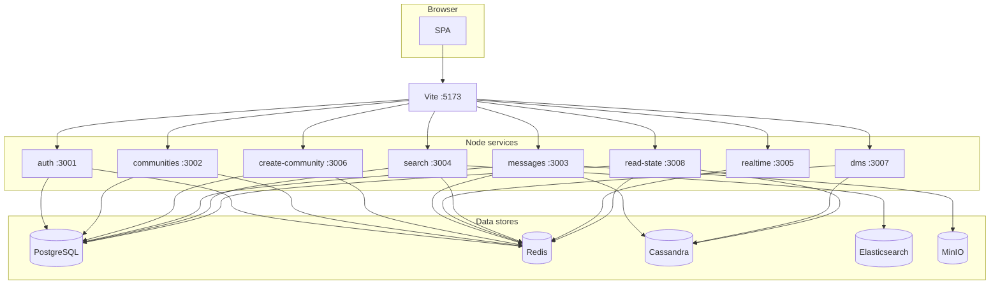

# CSE 356 — Discord-style messaging (monorepo)

Node **microservices** (Express + TypeScript), a **React (Vite)** client, and shared data stores (**PostgreSQL**, **Redis**, **Cassandra**, **Elasticsearch**, **MinIO**). Auth, guilds, channels, DMs, message search, WebSockets, and read-state are implemented in this repo—see **[docs/IMPLEMENTATION.md](./docs/IMPLEMENTATION.md)** for a factual checklist.

| Doc | Purpose |
|-----|---------|
| **[docs/README.md](./docs/README.md)** | Documentation index |
| **[docs/CLAUDE.md](./docs/CLAUDE.md)** | Stack map, conventions, proxy table (for editors / AI) |
| **[docs/STAGING-ROLLOUT.md](./docs/STAGING-ROLLOUT.md)** | Staging VM runbook |
| **[docs/PROD-SPLIT-NGINX.md](./docs/PROD-SPLIT-NGINX.md)** | Production: **frontend VM + backend VM** nginx |

---

## Architecture (local dev)

With **`npm run dev:all`**, the browser loads the app from **Vite :5173**, which **proxies** API paths to localhost services (same path order as `frontend/vite.config.ts`).



**Proxy map (prefix → default target):**

| Prefix | Port | Service area |
|--------|------|----------------|
| `/auth` | 3001 | Sessions, OAuth |
| `/create-community` | 3006 | Create guild |
| `/communities`, `/channels`, `/search-communities` | 3002 | Guilds, channels; directory search **proxies to search (ES)** |
| `/messages`, `/attachments` | 3003 | Channel messages, presign |
| `/search` | 3004 | Message search + ES directory API (`/directory/communities`) |
| `/dms` | 3007 | Direct messages |
| `/read-state` | 3008 | Read / unread state |
| `/ws` | 3005 | WebSocket (upgrade) |

Scaling and sharding notes: **[docs/sharding-and-replication.md](./docs/sharding-and-replication.md)**.

---

## Prerequisites

- **Node.js** 18+
- **npm** (workspaces at repo root)
- **Docker** + Docker Compose (recommended for Postgres, PgBouncer, Redis, ES, MinIO)
- **Cassandra** on `127.0.0.1:9042` for messages / DMs / read-state (enable the compose service if present, or install locally)

---

## Quick start

### 1) Dependencies via Compose

From the repo root:

```bash
docker compose up -d
```

Match **`.env`** to your ports (see **[`.env.example`](./.env.example)**). Postgres is usually exposed on **5433**; apps often use **PgBouncer** on **6432** for `DATABASE_URL`.

### 2) Install and migrate

```bash
npm install
npm run db:migrate
```

### 3) Run the stack

**Full local stack** (all services + frontend proxying to localhost):

```bash
npm run dev:all
```

Open **http://localhost:5173**.

**Frontend only, APIs on staging** (default `npm run dev`):

```bash
npm run dev
# same as: npm run dev:frontend:staging
```

Override API host:

```bash
VITE_API_ORIGIN=http://127.0.0.1 npm run dev:frontend
```

**Compose + full stack in one go:**

```bash
npm run dev:local
```

---

## npm scripts

| Script | Description |
|--------|-------------|
| `npm run dev` | Frontend → staging API (`VITE_API_ORIGIN` default) |
| `npm run dev:all` | Auth, communities, messages, search, realtime, create-community, dms, read-state, frontend → **localhost** |
| `npm run dev:local` | `docker compose up -d` then `dev:all` |
| `npm run dev:auth` … `npm run dev:read-state` | Individual services |
| `npm run dev:frontend` | Vite only (use with `VITE_API_ORIGIN`) |
| `npm run db:migrate` / `npm run db:generate` | Drizzle migrations (auth workspace) |
| `npm run build` | Auth + frontend production build |
| `npm run k6:routes` | k6 smoke: health + `search-communities` (requires [k6](https://k6.io/docs/get-started/installation/)) |
| `npm run k6:search-messages` | k6 authenticated message search (needs env; see `k6/search-messages-latency.js`) |
| `npm run diagnostics:local` | Local diagnostics script |

---

## Communities & channels (quick reference)

Create/join/list guilds and channels on **:3002**; create flow on **:3006**. Full route table lives in **[docs/DEV-28-Channels-scaffold-communities-service.md](./docs/DEV-28-Channels-scaffold-communities-service.md)**.

---

## Project layout

```
docs/                 # All long-form docs + nginx examples
k6/                   # Load / latency smoke tests
ansible/              # Optional split-VM deploy playbook
services/
  auth/               # 3001
  communities/      # 3002
  messages/           # 3003
  search/             # 3004
  realtime/           # 3005
  create-community/   # 3006
  dms/                # 3007
  read-state/         # 3008
frontend/             # Vite 5173
```

---

## Environment

- Copy **`.env.example`** → **`.env`** (or get a team `.env`).
- Per-machine overrides: **`ENV_FILE=/path/to/.env.other`** when starting a service.
- Staging template reference: **[docs/env.staging.example](./docs/env.staging.example)**.

---

## Git workflow

Integration branch: **`main-dev`**. Default feature flow: work on **`nick`**, open PRs **`nick` → `main-dev`**. Details: **[docs/branching.md](./docs/branching.md)**.

---

## Troubleshooting

- **Redis** — `redis-cli ping` or check the compose service.
- **Postgres / migrate** — ensure `auth_db` exists and `DATABASE_URL` / `DATABASE_URL_DIRECT` match compose ports (**5433** direct, **6432** PgBouncer when enabled).
- **Port bind errors** — align `POSTGRES_PORT` / `DATABASE_URL` with nothing else bound on that host port.
- **Cassandra** — messages and DMs expect Cassandra; if compose has Cassandra disabled, run Cassandra separately or uncomment the service in `docker-compose.yml`.
- **App port in use** — change the relevant `*_PORT` in `.env` or free the port.

---

## License / course

Private course project; see team agreement for reuse.
