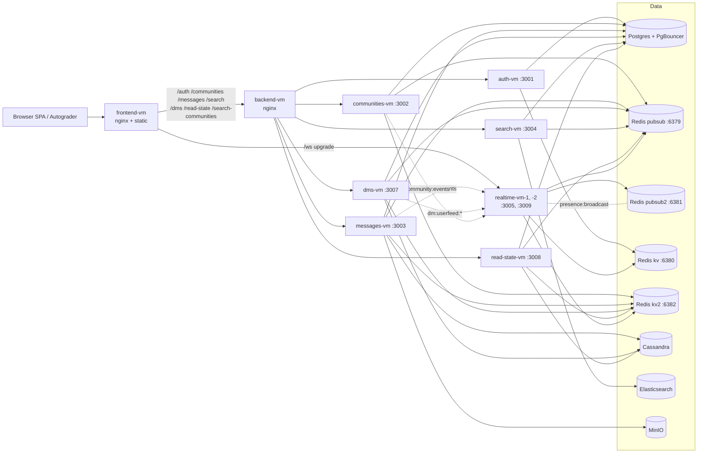

# CSE 356 — Discord-style Messaging System

A multi-service, real-time messaging platform (Discord clone): users, communities (guilds), channels, direct/group messages, presence, search, attachments, and infinite-scroll history. Built as a TypeScript monorepo, deployed across 11 VMs behind nginx, fronted by a Vite + React 18 SPA.

This README covers the six sections required by the course rubric. Deeper material lives in the linked docs.

| Section | |
|---------|---|
| 1. [Project Overview](#1-project-overview) | What the system does, components, how they interact |
| 2. [Running the System](#2-running-the-system) | Prereqs, env, build, start/stop, test |
| 3. [Scaling and Load Handling](#3-scaling-and-load-handling) | Bottlenecks, evidence, fixes, tradeoffs |
| 4. [Design Decisions](#4-design-decisions) | Storage, caching, concurrency, delivery, fault tolerance |
| 5. [Developer Guide](#5-developer-guide) | Repo layout, adding features, debugging |
| 6. [Team Process and Contributions](#6-team-process-and-contributions) | See [TEAM.md](./TEAM.md) |

Companion docs: [ARCHITECTURE.md](./docs/ARCHITECTURE.md) · [SCALING.md](./docs/SCALING.md) · [TESTING.md](./docs/TESTING.md) · [DEPLOYMENT.md (PROD-SPLIT-NGINX.md)](./docs/PROD-SPLIT-NGINX.md) · [TEAM.md](./TEAM.md) · [docs index](./docs/README.md).

---

## 1. Project Overview

A real-time text messaging server modelled on Discord. Users register or sign in (local + OAuth: Google, GitHub, course OIDC), join communities, browse public/private channels, exchange messages with image attachments, search history, and see live presence.

### Major components

| Layer | Implementation |
|-------|----------------|
| **Client** | React 18 + Vite + Tailwind SPA (`frontend/`) |
| **API gateway** | nginx (TLS + path routing); see [docs/PROD-SPLIT-NGINX.md](./docs/PROD-SPLIT-NGINX.md) |
| **Microservices** | 7 Node + Express + TypeScript services (auth, communities, messages, search, realtime, dms, read-state) |
| **Sessions / pub-sub / cache** | Redis — split into 4 single-threaded `redis-server` instances on one 8-core VM (`pubsub:6379`, `pubsub2:6381`, `kv:6380`, `kv2:6382`) |
| **Relational store** | PostgreSQL 15 + PgBouncer (Drizzle ORM) — users, identities, communities, channels, memberships |
| **Time-series store** | Cassandra — channel message history (partition `channel_id`) and DM history (partition `conversation_id`) |
| **Search** | Elasticsearch — message search + community directory index, fed from Postgres + Redis events |
| **Object storage** | MinIO (S3-compatible) — image attachments via presigned PUT/GET |
| **Realtime transport** | WebSocket `/ws` on the realtime service; pub-sub fan-out from message/dms/communities → realtime |
| **Monitoring** | Zabbix agent2 on every VM; per-port Redis monitoring (see [docs/zabbix-redis-monitoring.md](./docs/zabbix-redis-monitoring.md)) |
| **Deploy** | Ansible playbook (`ansible/`) over 11 VMs |

### How clients, servers, and stores interact



**Pub-sub channels:**

| Channel | Publisher | Subscriber | Purpose |
|---------|-----------|------------|---------|
| `channel:events` | messages | realtime, search | Channel message create/edit/delete |
| `dm:userfeed:{0..19}` | dms, read-state | realtime | Sharded DM delivery (key = userId) |
| `community:events` | communities | realtime | Guild/channel/membership changes |
| `presence:broadcast` | realtime | realtime (peers) | Cross-instance presence deltas |

For the full architecture (split-VM topology, sharding, replication, Cassandra schema), see [docs/ARCHITECTURE.md](./docs/ARCHITECTURE.md) and [docs/sharding-and-replication.md](./docs/sharding-and-replication.md).

---

## 2. Running the System

### Required dependencies

- **Node.js** 18+ (uses npm workspaces)
- **Docker** + **Docker Compose** (data plane: Postgres, PgBouncer, Redis, Elasticsearch, MinIO, Cassandra)
- **k6** (optional — load tests)
- **ansible** ≥ 2.15 + SSH access to staging VMs (deploy only)

### Configuration

Copy and edit env files:

```bash
cp .env.example .env                  # local dev
cp docs/env.staging.example .env.staging  # talk to live infra
```

Key variables:

| Variable | Used by | Notes |
|----------|---------|-------|
| `DATABASE_URL` / `DATABASE_URL_DIRECT` | every service | PgBouncer (6432) for app traffic; direct (5433) for migrations |
| `REDIS_URL` | every service | pub-sub primary (`channel:events`, `dm:userfeed:*`) |
| `META_REDIS_URL` | realtime, communities | meta pub-sub (`presence:broadcast`, `community:events`) |
| `KV_REDIS_URL` | every service | sessions, OAuth state, instance registry |
| `KV_CACHE_REDIS_URL` | most services | community cache, presence state, read-state cache |
| `CASSANDRA_CONTACT_POINTS` | messages, dms, read-state | channel + DM history |
| `ELASTICSEARCH_URL` | search | message + directory index |
| `MINIO_ENDPOINT`, `MINIO_ACCESS_KEY`, `MINIO_SECRET_KEY` | messages | attachment presign |
| `SESSION_COOKIE_DOMAIN` | auth | empty for localhost; set in prod |
| `LOG_LEVEL` | every service | trace/debug/info/warn/error/fatal; runtime override via `POST /internal/log-level` |

### Build, start, test

```bash
# 1. Data plane
docker compose up -d

# 2. Install + migrate
npm install
npm run db:migrate

# 3. Run everything locally (frontend + 7 services)
npm run dev:all          # browser → http://localhost:5173

# 3b. Or run frontend against staging APIs
npm run dev              # VITE_API_ORIGIN=https://group-6.cse356...

# 3c. Or one local service + staging for the rest (hybrid)
sshuttle -r deploy@130.245.136.45 10.0.0.0/8 &
npm run dev:dms:staging
VITE_DMS_ORIGIN=http://localhost:3007 npm run dev:frontend:hybrid

# 4. Tests
npm run test:api          # full API test suite vs staging
npm run test:trace        # WebSocket trace test vs staging
npm run k6:routes         # k6 smoke (requires k6 binary)
npm run k6:search-messages
```

Stop: `Ctrl-C` the `dev:*` process; `docker compose down` for the data plane.

### Cloud assumptions

Production runs on 11 VMs (one frontend, one backend, one per microservice, two realtime, plus dedicated VMs for Postgres, Redis, Cassandra, Elasticsearch, MinIO). Local single-node dev points all four `*_REDIS_URL` vars at one Redis container; only multi-node redis split applies in staging/production. Public domain `group-6.cse356.compas.cs.stonybrook.edu` fronts the frontend VM; backend VMs are in a private 10.0.0.0/8 subnet.

Full deployment runbook: [docs/STAGING-ROLLOUT.md](./docs/STAGING-ROLLOUT.md), [docs/PROD-SPLIT-NGINX.md](./docs/PROD-SPLIT-NGINX.md).

---

## 3. Scaling and Load Handling

The system was load-tested with the course autograder (concurrent WebSocket clients sending channel and DM traffic, plus search and presence operations). The first run revealed multiple bottlenecks; each was fixed and re-measured before moving on. Full bottleneck-by-bottleneck analysis lives in [docs/SCALING.md](./docs/SCALING.md); this section summarises the most consequential ones.

### 3.1 Redis VM saturation — the dominant bottleneck

**Symptom.** Under load, WebSocket fan-out latency rose into the hundreds of ms and the autograder reported `Delivery timeout` errors. The Redis VM (originally 4 vCPU) ran near 100% CPU on a single core; aggregate VM CPU still showed headroom because each `redis-server` is single-threaded.

**Evidence gathered.**

```bash
redis-cli -p 6382 INFO commandstats | sort -t= -k2 -n -r | head -20
# cmdstat_smembers:calls=320871,usec=117441321,usec_per_call=366.01
# cmdstat_scan:calls=1617,usec=220399,usec_per_call=136.30

redis-cli -p 6382 --bigkeys
# Biggest set found "presence:channel:c86ce7c2-..." has 1521 members

redis-cli -p 6382 SLOWLOG GET 20
# Repeated entries: SMEMBERS presence:channel:c86ce7c2-... taking 10–160 ms
```

`SMEMBERS` was the single largest CPU consumer on the kv-cache instance: 320k calls, ~366 µs average, with a single hot channel set holding 1521 members and showing up in slowlog at 10–160 ms per call. `SCAN MATCH presence:conns:*` was a steady contributor on startup and during reaper passes.

**Changes made.**

1. **In-memory TTL cache for membership sets** in `services/realtime/src/index.ts`. `presence:channel:*` and `presence:guild:*` SMEMBERS results are cached for 2 s with inflight-request dedupe. Three call sites (`fanOutToChannel`, `fanOutToGuild`, `channel:message:create` direct delivery) all use the cached helper. Cuts SMEMBERS QPS by roughly 100× because hot channels collapse to ~1 round-trip every 2 s instead of one per event.
2. **`presence:conns:index` SET replaces `SCAN`.** `services/realtime/src/presence.ts` now `SADD`s the userId on every `registerConnection` and `SREM`s + `DEL`s the hash when the last conn closes. Both startup cleanup and the periodic stale-instance reaper iterate via `SMEMBERS PRESENCE_CONNS_INDEX` instead of walking the keyspace. The reaper also self-heals empty hashes by `SREM`ing them — covers crash-loop residue.
3. **Vertical scale + room for split.** The Redis VM was resized 4 vCPU → 8 vCPU. Four single-thread instances continue using four cores; the four spare cores are reserved for `presence:6383` if hot-key isolation is needed in a future round.
4. **Operational visibility.** Per-port Redis monitoring wired through Zabbix agent2's built-in Redis plugin — see `ansible/roles/zabbix-agent/` and [docs/zabbix-redis-monitoring.md](./docs/zabbix-redis-monitoring.md). Triggers alarm on per-port memory pressure, slowlog growth, blocked clients, and process death. Aggregate VM CPU triggers alone hide single-core saturation.

**Why it helped.** Single-threaded Redis serialises every command on one event loop; a 30 ms SMEMBERS blocks every other client for 30 ms. Collapsing repeat reads to a 2 s in-process cache removes the head-of-line blocking entirely. Replacing `SCAN MATCH` with a maintained set avoids the keyspace walk that itself appeared in slowlog.

**Tradeoffs / remaining limitations.**

- 2 s window where a newly-joined user could miss one fan-out event. Acceptable for messaging — set repopulates fast and at-most-2 s presence lag is invisible.
- The Redis VM is still a single point of failure. Replication / clustering deferred — not free (sharded pubsub semantics, multi-key constraints) and the per-port split absorbed the observed load. Documented as a follow-up.
- `pubsub2` and `kv2` instances are deployed but not yet client-routed; finishing client-side hash routing is the cheapest next step before cluster.

### 3.2 DM delivery reliability under load

**Symptom.** Autograder DM tests reported intermittent `Delivery timeout` errors at high concurrency.

**Evidence.** Service logs showed bursts of `ws.send` callbacks queued behind a single hot DM target. Connection-close tracing showed sockets that were dead for ~25 s before the heartbeat detected them, during which messages were silently queued and dropped.

**Changes made (full table in [docs/IMPLEMENTATION.md](./docs/IMPLEMENTATION.md#dm-delivery-reliability)).**

- **Sharded pub-sub:** DM events publish to one of 20 `dm:userfeed:{shard}` channels keyed by userId. Realtime instances subscribe all 20 shards but only deliver to locally-connected users.
- **Per-socket outbound queue** drained via `setImmediate`; kills the socket on >512 queued messages or 1 MB buffered.
- **Synchronous dead-socket eviction** — `ws.send` failure removes the connection from local maps before the close handler runs, so further fan-out skips the corpse.
- **Cassandra replay on reconnect** — uses a `disconnectedAt`-based time window instead of per-conversation read cursors. One range query per conversation; saves ~1 Cassandra read per conversation per reconnect.
- **Server-side dedup** — last 512 message IDs per connection block double-delivery from the parallel pub-sub + direct-HTTP fanout paths.
- **Pending queue** (`dm:pending:{userId}`) bridges the reconnect gap before Cassandra replay catches up.

**Why it helped.** Each layer addresses a specific failure: pub-sub fan-out cost, socket-level head-of-line blocking, dead-socket detection latency, missed messages during reconnect, and double-delivery from the two paths. Combined, the autograder's `Delivery timeout` errors stopped reproducing.

### 3.3 Hot-path query reduction (caches and projections)

- **Communities directory** uses an Elasticsearch projection populated from Postgres on startup + live `community:events`. The SPA's `/search-communities` is a thin BFF that hits ES, not Postgres. `comm:e:*` epoch keys plus `comm:c:*` payload caches in `kv2` collapse repeat directory reads.
- **Read-state** uses `rs:latest:ch:*`, `rs:cs:*`, `rs:ds:*`, `rs:mc:*` Redis caches in `kv2` for unread/state lookups, falling back to Cassandra.
- **Auth** uses opaque UUID tokens in `kv` (`session:<token> → internal_id`) — every request hits Redis, not Postgres.

These projections were a deliberate choice early in the project to keep Postgres free for writes. Under the autograder load, Postgres CPU stayed under 30%; Cassandra read load similarly dropped after the read-state cache landed.

### 3.4 Service-level concurrency

- Multi-core VMs run a `cluster.ts` entry point that forks one worker per CPU core (auth, communities, messages clustered; realtime not clustered because it's I/O-bound and already supports multi-instance via the instance registry).
- Two realtime instances on `realtime-vm-1` and `realtime-vm-2` (`:3005` + `:3009`) sit behind nginx round-robin. Cross-instance presence flows over `presence:broadcast` on `pubsub2`.

### 3.5 Tradeoffs and what we did not solve

- **No HA on data stores.** Single-primary Postgres, single Redis VM, single Elasticsearch node. Replicas are designed for ([docs/sharding-and-replication.md](./docs/sharding-and-replication.md)) but not deployed — outside course scope.
- **No RabbitMQ.** Inter-service async events still go through Redis pub-sub. Adequate for current scale; would matter for cross-region or guaranteed-once delivery.
- **Postgres sharding by community** is documented in `docs/sharding-and-replication.md` but not implemented; messages already on Cassandra absorb the per-channel write load.

---

## 4. Design Decisions

### Storage

| Choice | Why |
|--------|-----|
| **Postgres for identity, guilds, channels, membership** | ACID, strong constraints, easy migrations via Drizzle. These tables are read-heavy with low row counts (tens of thousands of communities, low-millions of memberships). |
| **Cassandra for channel messages and DMs** | Append-only history with `channel_id` / `conversation_id` partitions scales horizontally without sharding logic in app code. Time-uuid clustering supports paginated history. |
| **Elasticsearch for search + directory** | Free-text search on message bodies + wildcard directory queries don't fit Postgres `LIKE`. ES is a projection — Postgres remains source of truth for community rows. |
| **Redis split into 4 single-threaded instances** | One `redis-server` per port + per workload prevents pubsub fanout from blocking session GETs on a single event loop. Each instance pins to one core. |
| **MinIO for attachments** | S3-compatible presign keeps binary data out of the JSON request path; the messages service issues short-lived PUT/GET URLs. |

### Caching strategy

- **Epoch-based invalidation** on community + member caches (`comm:e:*`): incrementing the epoch atomically invalidates every dependent cache key without a sweep.
- **Read-through, time-bounded** caches for read-state (`rs:*`) and presence membership sets (in-process, 2 s TTL).
- **Source-of-truth never stale** — caches are always projected from Postgres or Cassandra; on cache miss the canonical store answers.

### Queuing strategy

- **Redis pub-sub** for cross-service events (`channel:events`, `dm:userfeed:*`, `community:events`, `presence:broadcast`).
- **Sharded fan-out** on DM events — 20 `dm:userfeed:{shard}` channels keyed by userId — bounds per-instance fan-out cost.
- **Per-user pending queue** (`dm:pending:<userId>`, capped at 100, TTL 2 h) bridges reconnect gaps. Drained on WebSocket connect.
- **No durable broker** (RabbitMQ / Kafka) — at this scale the loss-on-restart property of pub-sub is acceptable because Cassandra is the durable record and replay-on-reconnect is implemented.

### Load balancing

- **nginx round-robin** between two realtime instances (`:3005`, `:3009`).
- **PgBouncer** in front of Postgres on the backend VM — keeps connection count bounded across all clustered Node workers.
- **Vite dev proxy** mirrors the production prefix order in development; same path order, different origins.

### Concurrency model

- **Node cluster** mode for CPU-multi-core services (auth, communities, messages). One worker per core; primary auto-restarts crashed workers.
- **Single-process realtime** with multi-instance scale-out via `realtime:instances` registry hash. Workers would compete for `connections.set`; horizontal scaling is by VM, not core.
- **In-process LRU + inflight dedupe** on the realtime fan-out path so concurrent fan-outs of the same channel coalesce into one Redis call.

### Message delivery

- **Channel messages:** publisher writes to Cassandra, then publishes `channel:events`. Realtime fans out to subscribers; search indexer projects into ES asynchronously.
- **DMs:** dual-path delivery — pub-sub + direct HTTP from dms to realtime via the instance registry — combined with server-side dedup and Cassandra replay on reconnect. Trades a small amount of network traffic for predictable delivery under flapping WebSockets.

### Fault tolerance / retry

- **Redis publish retries** on the dms write path (3 attempts, 50 ms / 100 ms backoff) before declaring publish failure.
- **Stale-instance reaper** clears `presence:conns:*` fields whose owning realtime instance is no longer in the registry — prevents permanent "online" state after a crash.
- **Pre-commit hook fail-soft** — the Ansible playbook deploys realtime before dms so DM publishers never see an outdated subscriber set.
- **No durable retry queues** — best-effort delivery layered with replay-on-reconnect; intentional given the Cassandra source-of-truth.

### API design

- **Path-based proxying.** Every public path is owned by exactly one backend service; nginx + Vite share the same prefix table. No service reaches into another's routes.
- **Sessions, not JWT.** Opaque UUID tokens in Redis (`session:<token> → internal_id`); cookie `session_token` is HttpOnly + SameSite. JWT was rejected because session revocation should be a single Redis DEL.
- **Internal endpoints prefixed with `/internal/`** (e.g. `/internal/log-level`, `/internal/presence/:userId`) and only callable on the private network.
- **Every JSON response is small.** No service returns more than one entity + counts; pagination is timeuuid-based for messages, offset-based for directories.

### Security / authentication

- **OAuth providers:** Google, GitHub, course OIDC. Local password login uses bcrypt.
- **OAuth state + temp profile** in Redis (`oauth_state:*`, `oauth_temp:*`) with 10 min TTL — prevents CSRF on the callback step and lets the user pick a username post-OAuth.
- **ACL enforcement on every read.** Messages and channels services check `community_members` + `channel_members` before serving Cassandra rows; DMs check `dm_participants`.
- **Internal vs. public endpoints** are split at the nginx layer — `/internal/*` is rejected at the public gateway and only the backend VM's nginx proxies it.

---

## 5. Developer Guide

### Repository structure

```
.
├── README.md                # this file
├── TEAM.md                  # team reflection (§6)
├── docs/                    # all long-form documentation
│   ├── ARCHITECTURE.md
│   ├── SCALING.md
│   ├── TESTING.md
│   ├── PROD-SPLIT-NGINX.md  # production deploy
│   ├── STAGING-ROLLOUT.md   # staging runbook
│   ├── IMPLEMENTATION.md    # status checklist
│   ├── sharding-and-replication.md
│   ├── zabbix-redis-monitoring.md
│   ├── nginx/               # production nginx config examples
│   └── …
├── frontend/                # React + Vite SPA (port 5173)
│   ├── src/                 # components, hooks, pages
│   └── vite.config.ts       # path-prefix proxy table
├── services/
│   ├── auth/                # 3001 — sessions + OAuth
│   ├── communities/         # 3002 — guilds, channels, directory
│   ├── messages/            # 3003 — channel messages + attachments
│   ├── search/              # 3004 — Elasticsearch search + directory
│   ├── realtime/            # 3005 (+3009) — WebSocket fan-out
│   ├── dms/                 # 3007 — direct messages
│   └── read-state/          # 3008 — read receipts / unread
├── ansible/                 # playbook + roles + inventory
├── docker-compose.yml       # local data plane
├── scripts/                 # test harness + ops scripts
└── k6/                      # load tests
```

### Important files

| File | Why it matters |
|------|----------------|
| `services/auth/src/middleware/session.ts` | `requireAuth` — used by every other service over cookies |
| `services/auth/drizzle/` | Postgres migrations (shared across services) |
| `services/realtime/src/index.ts` | WebSocket server, fan-out, presence, instance registry |
| `services/realtime/src/presence.ts` | Presence state machine + `presence:conns:index` set |
| `services/messages/src/redis.ts`, `services/dms/src/redis.ts`, etc. | Per-service Redis client wiring (4 URLs) |
| `frontend/vite.config.ts` | Local proxy map; prefix order matters (`/search-communities` before `/search`) |
| `ansible/playbooks/site.yml` | Order-sensitive deploy; realtime before dms |
| `ansible/inventory/group_vars/redis.yml` | Per-port Redis instance + Zabbix session config |
| `docs/nginx/production-frontend.conf.example` | Public TLS edge |
| `docs/nginx/production-backend.conf.example` | Internal nginx in front of Node services |

### Adding or modifying a feature

1. **Plan the path.** Decide which service owns it. Cross-service flows talk over Redis pub-sub or HTTP; never reach into another service's database.
2. **Schema first.** If Postgres: add a Drizzle migration in `services/auth/drizzle/` and run `npm run db:migrate`. If Cassandra: update the keyspace bootstrap in the relevant service.
3. **Add a route + DAO.** Routes in `src/routes/`, DAOs in `src/dao/`, env in `src/env.ts` (zod-validated).
4. **Wire frontend.** Add a path entry in `frontend/vite.config.ts` if it's a new prefix. Build hooks under `frontend/src/`.
5. **Test.** Write a smoke against the API (see `npm run test:api`); for realtime, extend `npm run test:trace`.
6. **Deploy.** PR to `main-dev`. CI deploys to staging on merge — see `.github/workflows/deploy-staging.yml`.

### How to run tests

```bash
npm run test:api          # API tests against staging (uses GeneratedClient)
npm run test:trace        # WebSocket trace test against staging
npm run k6:routes         # k6 health + search smoke
npm run k6:search-messages
```

Per-service unit tests where they exist live under `services/<svc>/tests/`.

### How to debug common problems

- **401 from a service in dev.** Sessions are Redis-backed. Confirm `KV_REDIS_URL` points to the right Redis and that you logged in via `/auth/login` recently.
- **Realtime says user is online but no socket.** `presence:conns:<userId>` hash has a stale field from a crashed instance — the reaper clears it within 30 s, or run `redis-cli -p 6382 DEL presence:conns:<userId>`.
- **Redis VM hot.** First port of call: `redis-cli -p <port> INFO commandstats | sort -t= -k2 -n -r | head` and `SLOWLOG GET 20`. See [docs/SCALING.md](./docs/SCALING.md) for the SMEMBERS / SCAN root causes already fixed.
- **DM `Delivery timeout` in tests.** Check that both `dms` and `realtime` services were deployed together (Ansible enforces order; manual restarts can split them).
- **Logs.** Every service exposes `POST /internal/log-level`. Bump live: `npm run log-level dms debug` or `npm run log-level all debug`. Reset: `npm run log-level:reset`.

### Known issues / future improvements

- `services/auth/src/index.ts` has duplicate `GET /` handlers; first registered wins.
- `pubsub2` and `kv2` Redis instances exist but aren't yet client-routed — easy follow-up for additional headroom.
- No durable async broker (RabbitMQ deferred).
- No HA on Postgres or Redis. Replication is the next infrastructure milestone.
- Redis Cluster is not deployed; rationale and migration sketch in [docs/SCALING.md](./docs/SCALING.md).

---

## 6. Team Process and Contributions

See [TEAM.md](./TEAM.md) for member-by-member responsibilities, contributions, and reflection.

---

## License / course

Private course project (CSE 356, Stony Brook University). See team agreement for reuse.
