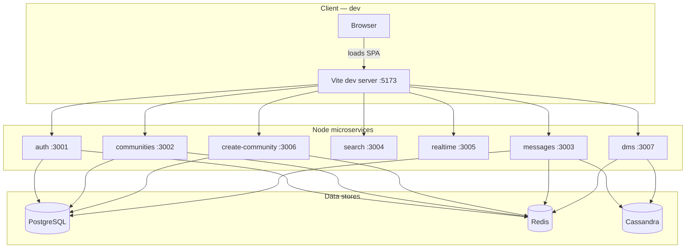

# Discord Clone (CSE 356) — Monorepo

Monorepo containing multiple backend services plus a React frontend. The primary backend service in this repo is the authentication service (Express) with session auth backed by Redis and PostgreSQL.

Implementation scope and how this compares to the full architecture (nginx, Cassandra messages, Elasticsearch, DMs over WebSockets/SSE, etc.) is documented in **[docs/IMPLEMENTATION.md](./docs/IMPLEMENTATION.md)**. An index of all project docs (including the Cursor-oriented guide and feature write-ups) is in **[docs/README.md](./docs/README.md)**.

## Architecture

The diagram below reflects **local development** (`npm run dev:all`): the browser loads the React app from the Vite dev server (**5173**), which **proxies** API paths to the matching backend port (see `frontend/vite.config.ts`). In production you would typically put a reverse proxy in front of the same routes.

**Data:** Auth, communities, and create-community share **PostgreSQL** (Drizzle migrations under `services/auth/drizzle/`). The **messages** service stores **channel** history in **Cassandra** (`messages_by_channel`, default keyspace **`messaging`** via **`MESSAGES_CASSANDRA_KEYSPACE`**) while still using Postgres for channel metadata and ACL checks via **`channel_members`**. Session cookies are validated via **Redis** on those services. The **DM** service uses a separate Cassandra keyspace for DM data (see [DEV-27](./docs/DEV-27-Direct-conversations-dm-service-setup.md)). **Search** and **realtime** are still stubs for non-persistent behavior.



**Proxy map (same order as Vite config matters for overlapping prefixes):**

| Browser path prefix | Target |
|----------------------|--------|
| `/auth` | :3001 |
| `/create-community` | :3006 |
| `/communities`, `/channels`, `/search-communities` | :3002 |
| `/messages`, `/attachments` | :3003 |
| `/search` | :3004 |
| `/ws` (WebSocket) | :3005 |
| `/dms` | :3007 |

**Future scaling:** Notes on sharding by community, replication, and routing are in **[docs/sharding-and-replication.md](./docs/sharding-and-replication.md)**.

## Prerequisites

- **Node.js** v18+
- **PostgreSQL** reachable from the app (often `localhost:5433` when using Docker Compose; `5432` for a local-only install)
- **Redis** running on `localhost:6379`
- **Cassandra** on `localhost:9042` for channel messages and DMs (included in `docker compose up`)
- **Docker** + Docker Compose (optional but recommended for Postgres + Redis + Cassandra), **or** install dependencies via Homebrew

## Quick Start

### 1. Start Postgres, Redis, and Cassandra

**Option A — Docker Compose (one command)**  
From the repo root:

```bash
docker compose up -d
```

This starts Postgres on host **5433**, Redis on **6379**, and Cassandra on **9042** (see [`docker-compose.yml`](./docker-compose.yml)). Copy [`.env.example`](./.env.example) to `.env` and set `DATABASE_URL` to use port **5433** for the DB. Channel messages (`messages` service) and DMs expect Cassandra reachable at **`127.0.0.1:9042`** by default (see optional `CASSANDRA_*` variables in `.env.example`). Stop with `docker compose down`.

**Option B — Docker without Compose**

```bash
docker run -d --name postgres-auth -p 5432:5432 -e POSTGRES_PASSWORD=123456789 -e POSTGRES_DB=auth_db postgres:16-alpine
docker run -d --name redis-auth -p 6379:6379 redis:7-alpine
```

**Option C — no Docker**  
Install and run Postgres and Redis locally (e.g. `brew install postgresql redis` and `brew services start …`).

If you already have Postgres/Redis installed locally, just make sure they're running.

### 2. Install dependencies

```bash
npm install
```

### 3. Set up environment variables

Get the `.env` file from a team member and place it in the project root.
Important: keep service ports distinct in `.env`:
- `PORT=3001` (auth)
- `COMMUNITIES_PORT=3002`
- `CREATE_COMMUNITY_PORT=3006`

### 4. Run database migrations

```bash
npm run db:migrate
```

### 5. Start services

Start the auth service (required for login):

```bash
npm run dev:auth
```

Start the React frontend:

```bash
npm run dev:frontend
```

The frontend will be running at **http://localhost:5173**.

- Login (wireframe UI): http://localhost:5173/login
- Chat (wireframe UI): http://localhost:5173/

Optional stub services for the wireframes:

- `npm run dev:create-community` (port 3006)
- `npm run dev:communities` (port 3002)
- `npm run dev:messages` (port 3003)
- `npm run dev:search` (port 3004)
- `npm run dev:realtime` (port 3005)

Note: the frontend includes fallback sample data, so it can render even if some stub services are not running.

## Using a shared staging backend (frontend local, services remote)

If `auth`, `communities`, `create-community`, and `realtime` are already running on the staging box (**`130.245.136.45`**), you can run only the frontend locally and proxy API calls to staging.

- **Frontend → staging (recommended)**:

```bash
npm run dev:frontend:staging
```

This routes `/auth`, `/communities`, `/create-community`, and `/ws` (WebSocket) to the staging host by default.

If you prefer, you can run Vite with explicit env vars:

```bash
VITE_API_ORIGIN=http://130.245.136.45 npm run dev:frontend
```

### Default local dev behavior (important)

- `npm run dev` proxies APIs to **staging** (`130.245.136.45`).
- `npm run dev:all` is the exception: it is **local-only** and forces the frontend to proxy APIs to **localhost** so the full local stack works end-to-end.

- **Frontend → staging, but keep some services local**:

```bash
npm run dev:frontend:staging-lite
```

This proxies most routes to staging but keeps `/messages`, `/search`, and `/dms` pointing at localhost (so you can run those locally if desired).

- **Hybrid dev (recommended when staging already runs auth/communities/create-community/realtime)**:

```bash
npm run dev:hybrid
```

This starts local `messages` (3003), `search` (3004), and `dms` (3007), plus the frontend (5173) configured to proxy auth/communities/create-community/ws to staging at `130.245.136.45`.

Note: `messages` and `dms` require Cassandra. `dev:hybrid` will start the Cassandra container via `docker compose up cassandra`.

- **Hybrid dev without Cassandra (search-only local)**:

```bash
npm run dev:hybrid:no-cassandra
```

This starts only `search` locally and proxies the rest to staging. Use this when you don’t want to run Cassandra on your machine.

## Local vs staging environments (`ENV_FILE`)

Backend services load the repo-root `.env` by default, but you can override it with:

```bash
ENV_FILE=.env.staging npm run dev:staging:core
```

This repo includes a template at `docs/env.staging.example`.

### Communities (guilds / servers)

Users can **create** and **join** communities. A **community** is a named space with a **membership list** and **channels** (text/voice rows in the DB). A user may belong to many communities but may **create at most 100**.

**Create-community** (port **3006**, `services/create-community/`) is a separate service for **creating** communities: it enforces the **100 communities per user** limit, inserts the community row, adds the creator as **owner**, and seeds a default **#general** text channel.

**Communities** (port **3002**, `services/communities/`) handles listing, joining, leaving, **channels** (public/private, `channel_members`, admin-only create/update), members, and **public directory search** (`GET /search-communities`) for the “Join a server” modal. It uses the same PostgreSQL database as auth (see migrations under `services/auth/drizzle/`). Authenticated routes validate the **session cookie** (`session_token`) against Redis; directory search is public (no membership filter). New channel columns and `channel_members` ship with migration **`0006_*`** — run `npm run db:migrate` after pulling.

**Joining from search** uses **`POST /communities/:communityId/join`** (same service). Optional future work (invites, deep links) can live under `services/join/` without changing this path.

| Method | Path | Service | Purpose |
|--------|------|---------|---------|
| `POST` | `/create-community` | create-community (3006) | Create a community (body: `{ "name": "..." }`) |
| `GET` | `/communities` | communities (3002) | List communities the current user is in (each includes `role`: owner / admin / member) |
| `POST` | `/communities/:communityId/join` | communities (3002) | Join a community |
| `POST` | `/communities/:communityId/leave` | communities (3002) | Leave a community (removes membership) |
| `GET` | `/search-communities?q=...` | communities (3002) | Search public communities by name |
| `GET` | `/communities/:communityId/channels` | communities (3002) | List channels visible to caller (`is_private`, `joined`) |
| `POST` | `/communities/:communityId/channels` | communities (3002) | Create channel — body `{ "name", "type?", "is_private?", "position?" }` (owner/admin) |
| `PATCH` | `/communities/:communityId/channels/:channelId` | communities (3002) | Update `name` / `is_private` / `position` (owner/admin) |
| `POST` | `/communities/:communityId/channels/:channelId/join` | communities (3002) | Join a **public** channel |
| `POST` | `/communities/:communityId/channels/:channelId/leave` | communities (3002) | Leave channel (drops `channel_members`) |
| `POST` | `/communities/:communityId/channels/:channelId/members` | communities (3002) | Add user to channel — body `{ "user_id" }` (owner/admin; for private channels) |
| `DELETE` | `/communities/:communityId/channels/:channelId` | communities (3002) | Delete channel (owner/admin; cannot delete the last channel in a guild) |
| `GET` | `/communities/:communityId/members` | communities (3002) | Members with display names and roles |
| `GET` | `/messages?channelId=&before=&limit=` | messages (3003) | List channel messages (session; must be in `channel_members`) |
| `POST` | `/messages` | messages (3003) | Post message — body `{ "channelId", "content" }` (same ACL as GET) |

The Vite dev server proxies `/create-community` to port **3006**, `/communities` and `/search-communities` to port **3002**, `/messages` to **3003** (see `frontend/vite.config.ts`).

**Channels (DEV-28):** Implementation notes, API summary, and follow-up work are in [docs/DEV-28-Channels-scaffold-communities-service.md](./docs/DEV-28-Channels-scaffold-communities-service.md).

### Start everything at once (recommended for full-stack local dev)

Runs auth, all stub services, and the frontend together (uses [concurrently](https://www.npmjs.com/package/concurrently)):

```bash
npm run dev:all
```

Equivalent shell wrapper (from repo root):

```bash
chmod +x scripts/dev-all.sh   # once
./scripts/dev-all.sh
```

## Available Scripts

| Command | Description |
|---|---|
| `npm run dev:all` | Start auth + stubs + frontend in parallel |
| `npm run dev` | Start React frontend (port 5173) |
| `npm run dev:auth` | Start authentication service (port 3001) |
| `npm run dev:frontend` | Start React frontend (port 5173) |
| `npm run dev:create-community` | Start create-community service (port 3006) |
| `npm run dev:communities` | Start communities service (port 3002) |
| `npm run dev:messages` | Start messages service — channel chat API (port 3003) |
| `npm run dev:search` | Start search stub service (port 3004) |
| `npm run dev:realtime` | Start realtime stub service (port 3005) |
| `npm run db:generate` | Generate a new migration (auth service) |
| `npm run db:migrate` | Apply pending migrations (auth service) |

## Project Structure

```
docs/                 # Project documentation (see docs/README.md)
services/
  auth/
    src/
    public/
    drizzle/
  create-community/
  communities/
  messages/
  search/
  realtime/
frontend/
  src/
```

## Troubleshooting

- **Redis connection errors** — Make sure Redis is running: `docker ps` or `redis-cli ping`
- **Database migration fails** — Make sure Postgres is running and `auth_db` exists:
  - Docker Compose: `docker exec discord-clone-postgres psql -U postgres -d auth_db -c "SELECT 1"`
  - Docker run: `docker exec postgres-auth psql -U postgres -d auth_db -c "SELECT 1"`
- **Database migration fails** — Make sure Postgres is running and `auth_db` exists:
  - Docker Compose: `docker exec discord-clone-postgres psql -U postgres -d auth_db -c "SELECT 1"`
  - Docker run: `docker exec postgres-auth psql -U postgres -d auth_db -c "SELECT 1"`
- **`docker compose`: `5432: bind: address already in use`** — The compose file defaults to **5433** on the host for Postgres; if you still see this, you may have set `POSTGRES_PORT=5432` while something else uses 5432. Remove `POSTGRES_PORT` from `.env` or set `POSTGRES_PORT=5433`, and align `DATABASE_URL` with the host port.
- **Port already in use (app)** — Change `PORT` in `.env` or kill the existing process (auth defaults to 3001)
