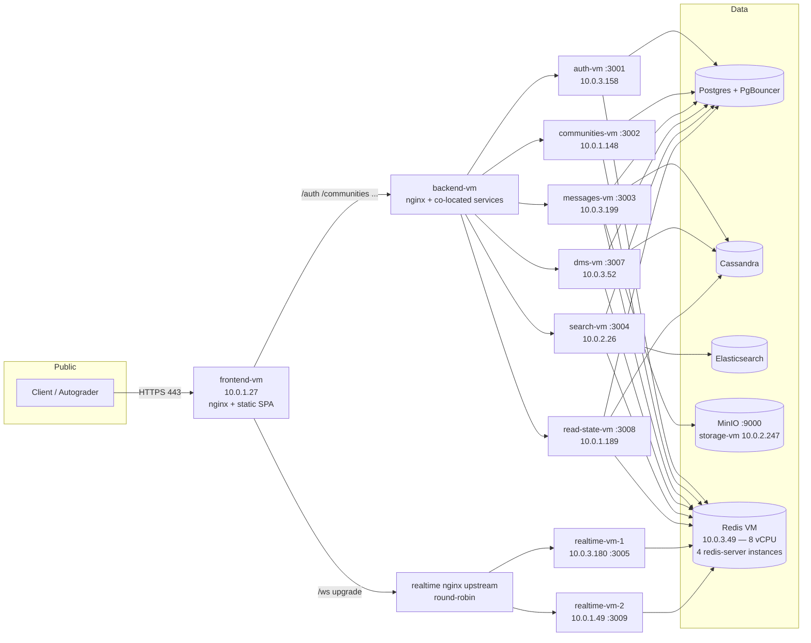
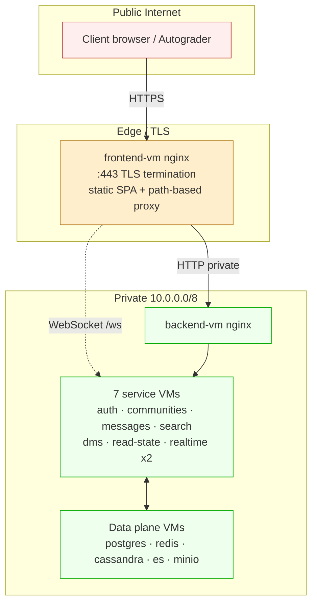
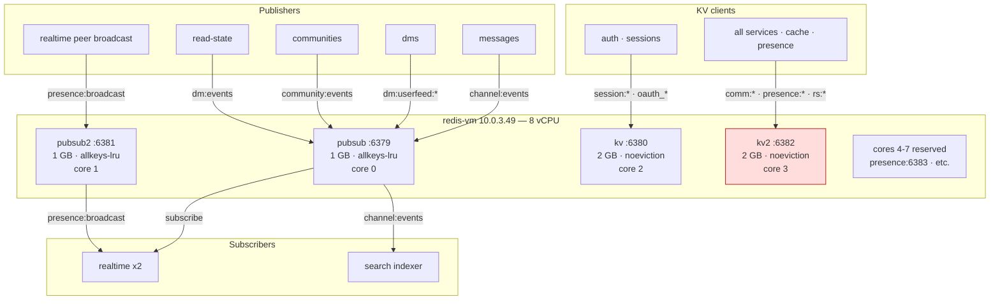
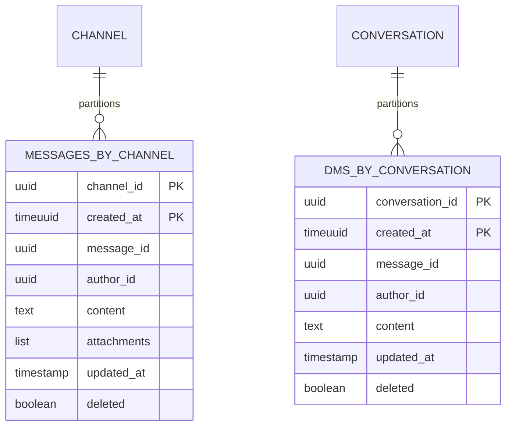
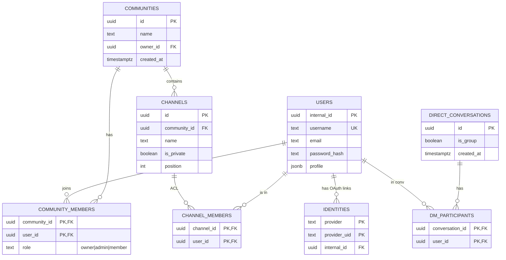
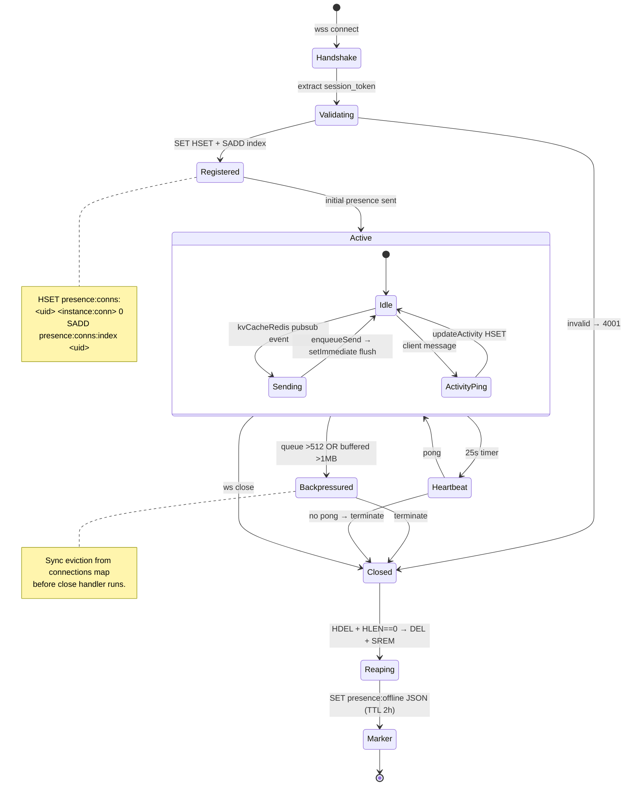
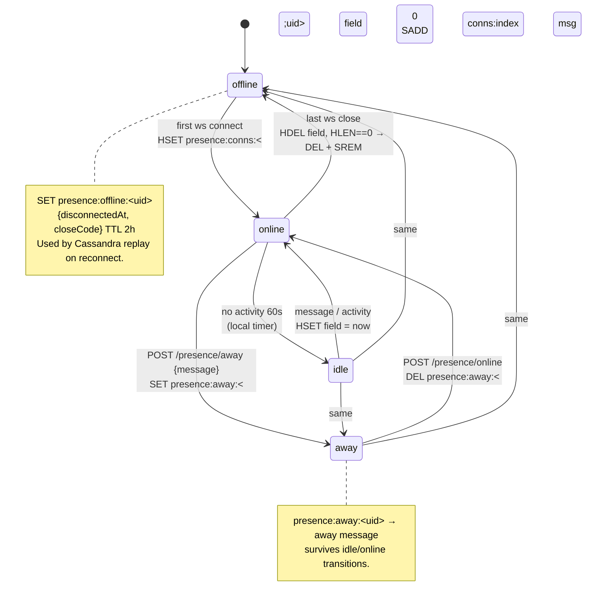
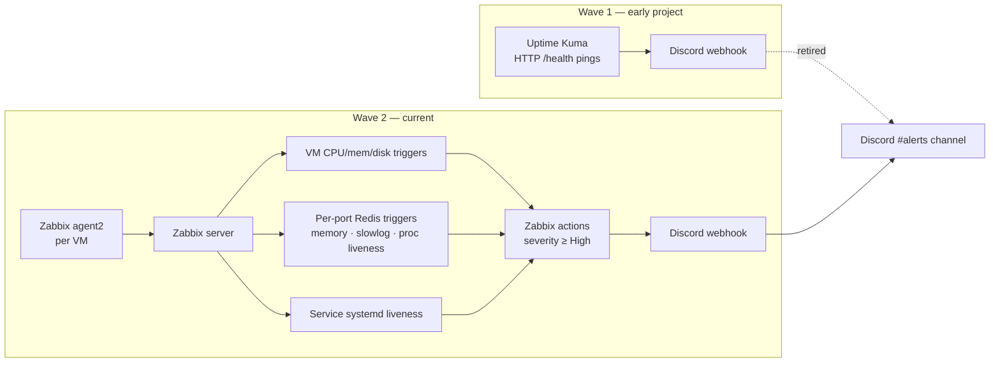

# Architecture

Companion to README §1 / §4. Goes deeper on topology, data flow, and the boundaries between services.

| Reference | Purpose |
|-----------|---------|
| [README §1](../README.md#1-project-overview) | High-level overview and component table |
| [docs/sharding-and-replication.md](./sharding-and-replication.md) | Cassandra partitioning + future Postgres sharding |
| [docs/SCALING.md](./SCALING.md) | Bottlenecks and fixes |
| [docs/PROD-SPLIT-NGINX.md](./PROD-SPLIT-NGINX.md) | Production nginx (frontend VM + backend VM) |
| [docs/CLAUDE.md](./CLAUDE.md) | Stack map and conventions |

---

## Production topology

11 VMs total: 1 frontend, 1 backend (nginx + co-located services), 7 service VMs, 2 realtime VMs, plus dedicated VMs for Postgres / PgBouncer, Cassandra, Elasticsearch, MinIO, Redis.



### Network zones



`/internal/*` endpoints are filtered at the public edge — only the backend-vm nginx forwards them.

## Redis topology

One VM (`redis-vm`, `10.0.3.49`, 8 vCPU). Four `redis-server` processes — single-threaded, each pinned to one core, each with its own `maxmemory` and eviction policy.

| Port | Name | Workload | maxmemory | Policy |
|------|------|----------|-----------|--------|
| 6379 | `pubsub` | `channel:events`, `dm:events`, `community:events`, `dm:userfeed:*`, `presence:broadcast` | 1 GB | `allkeys-lru` |
| 6381 | `pubsub2` | Second pubsub shard (provisioned, not yet client-routed) | 1 GB | `allkeys-lru` |
| 6380 | `kv` | `session:*`, `oauth_state:*`, `oauth_temp:*`, `realtime:instances` | 2 GB | `noeviction` |
| 6382 | `kv2` | `comm:e:*`, `comm:c:*`, `presence:*`, `dm:pending:*`, `rs:*` | 2 GB | `noeviction` |



Future scale-out (no infra change): split `presence:*` to `kv3:6383`. Four spare cores reserved.

## Cassandra schema sketch

| Keyspace.table | Partition key | Clustering | Use |
|----------------|--------------|-----------|------|
| `discord.messages_by_channel` | `channel_id` | `created_at DESC` (timeuuid) | Channel history pagination |
| `discord.dms_by_conversation` | `conversation_id` | `created_at DESC` | DM history pagination |
| `discord.read_state_*` | varies | varies | Read pointers / unread counts |

Replication strategy is configurable via `CASSANDRA_TOPOLOGY` (`simple` / `network`) + `CASSANDRA_REPLICATION_FACTOR`. See [docs/sharding-and-replication.md](./sharding-and-replication.md) for read/write consistency tuning and pagination semantics.



Hot read path: `SELECT ... WHERE channel_id = ? AND created_at < ? LIMIT 50` — single-partition, single-row-range scan. No fan-out across nodes.

## Postgres schema (high-level)

- `users` (`internal_id` UUID PK, `username`, `email`, `password_hash`, `profile` JSONB)
- `identities` (`provider`, `provider_uid` unique) — OAuth identity links
- `communities`, `community_members` (with roles `owner`, `admin`, `member`)
- `channels`, `channel_members` (`is_private` flag; backfilled for public channels on join)
- Migrations: `services/auth/drizzle/`. Run with `npm run db:migrate`.



## Service responsibilities

| Service | Owns | Reads | Publishes | Subscribes |
|---------|------|-------|-----------|------------|
| `auth` | users, identities | sessions in `kv` | — | — |
| `communities` | communities, members, channels, `channel_members` | `comm:*` cache, ES via search | `community:events` | `community:events` (cache invalidation) |
| `messages` | (delegates Cassandra writes) | Postgres ACL + Cassandra | `channel:events`, `messages:index` | — |
| `search` | ES indexes | Postgres + ES | — | `channel:events`, `community:events` |
| `realtime` | WebSocket connections | `presence:*`, `kv` instance registry | `presence:broadcast` | `channel:events`, `dm:userfeed:*`, `community:events`, `presence:broadcast` |
| `dms` | direct conversations | Postgres + Cassandra | `dm:userfeed:{shard}`, `dm:events` | — |
| `read-state` | read pointers, unread counts | Postgres + Cassandra + `rs:*` cache | `dm:events` (read state) | — |

Boundary rules:

- **Each service owns exactly one slice of the schema.** Cross-service reads go through HTTP, not direct DB queries into another service's tables.
- **Pubsub events flow one direction.** Publishers don't subscribe to their own events.
- **Internal endpoints** (`/internal/*`) are private-network only — nginx rejects them at the public edge.

## Frontend ↔ backend contract

The SPA talks to backends through path-prefix proxies. Same prefix order in `frontend/vite.config.ts` (dev) and the production nginx config (prod). Prefix order matters — `/search-communities` (communities BFF) must be proxied before `/search` (search service) or it would be swallowed.

## Authentication flow

1. Client `POST /auth/login` (local) or `GET /auth/oauth/<provider>` (OAuth).
2. Auth service issues opaque UUID `session_token` cookie (HttpOnly, SameSite). Token → `internal_id` in `kv` Redis (TTL 30 d, sliding).
3. Every subsequent request goes through `requireAuth` (`services/auth/src/middleware/session.ts`), which is imported and used by every other service.
4. OAuth state cached in `kv` (`oauth_state:*`, TTL 10 min) — CSRF protection on the callback.
5. Logout = `DEL session:<token>` in Redis.

No JWTs. The session-revocation property of "one Redis DEL invalidates everywhere" was the deciding factor.

```mermaid
sequenceDiagram
  autonumber
  participant C as Client
  participant FE as frontend nginx
  participant A as auth-vm
  participant K as Redis kv :6380
  participant PG as Postgres
  participant Other as any service<br/>(messages, dms, ...)

  Note over C,A: Local login
  C->>FE: POST /auth/login {email, pw}
  FE->>A: forward
  A->>PG: SELECT user / verify bcrypt
  A->>K: SET session:&lt;uuid&gt; → internal_id (TTL 30d)
  A-->>C: Set-Cookie session_token=&lt;uuid&gt; (HttpOnly, SameSite)

  Note over C,Other: Subsequent request
  C->>FE: GET /messages?channelId=...<br/>Cookie session_token=...
  FE->>Other: forward
  Other->>K: GET session:&lt;uuid&gt;
  K-->>Other: internal_id
  Other->>PG: ACL check
  Other-->>C: 200 / 403

  Note over C,A: Logout
  C->>A: POST /auth/logout
  A->>K: DEL session:&lt;uuid&gt;
  A-->>C: 204 + clear cookie
```

OAuth flow uses the same `kv` Redis to hold short-lived `oauth_state:<state>` (CSRF) and `oauth_temp:<token>` (post-callback profile picker) keys.

## Realtime flow

1. Client connects `wss://.../ws?session_token=...`.
2. Server validates session, registers in `connections` map, writes `presence:conns:<userId>` HSET field, adds userId to `PRESENCE_CONNS_INDEX` set, subscribes to per-channel + per-conversation events.
3. Server publishes initial presence; subscribes to `channel:events`, `dm:userfeed:<shard>`, `community:events`, `presence:broadcast`.
4. On message arrival, `getPresenceChannelMembers(channelId)` returns cached membership; loop fans out via per-socket queue.
5. On disconnect: HDEL field, HLEN check, on empty hash → DEL + SREM index, write `presence:offline:<userId>` JSON marker (TTL 2 h).
6. On reconnect with marker: range-query Cassandra for messages newer than `disconnectedAt - grace` and replay.

### Connection lifecycle



### Channel message delivery (publish + fan-out)

```mermaid
sequenceDiagram
  autonumber
  participant Author as Author client
  participant FE as frontend nginx
  participant M as messages :3003
  participant PG as Postgres
  participant CAS as Cassandra
  participant P1 as Redis pubsub :6379
  participant ES as Elasticsearch
  participant SRC as search :3004
  participant RT as realtime
  participant K2 as Redis kv2 :6382
  participant Subs as Other subscribers

  Author->>FE: POST /messages {channelId, content}
  FE->>M: forward
  M->>PG: ACL check (channel_members)
  M->>CAS: INSERT into messages_by_channel (channel_id partition)
  M->>P1: PUBLISH channel:events {type:create, channelId, ...}
  M-->>Author: 201 Created
  par index for search
    P1->>SRC: subscribe channel:events
    SRC->>ES: index document
  and fan-out
    P1->>RT: subscribe channel:events
    RT->>K2: getPresenceChannelMembers(channelId)<br/>(2s in-memory cache)
    alt cache miss
      RT->>K2: SMEMBERS presence:channel:&lt;id&gt;
      K2-->>RT: [user_ids]
    end
    RT-->>Subs: ws.send via per-socket queue
  end
```

### DM delivery (sharded pubsub + direct HTTP)

```mermaid
sequenceDiagram
  autonumber
  participant A as Sender client
  participant DMS as dms :3007
  participant PG as Postgres
  participant CAS as Cassandra
  participant P1 as Redis pubsub :6379<br/>shard hash(userId) % 20
  participant K2 as Redis kv2 :6382
  participant RT1 as realtime-vm-1
  participant RT2 as realtime-vm-2
  participant B as Receiver client

  A->>DMS: POST /dms/&lt;conv&gt;/messages {content}
  DMS->>PG: ACL (dm_participants)
  DMS->>CAS: INSERT dms_by_conversation
  DMS->>P1: PUBLISH dm:userfeed:&lt;shard&gt; {targetUserId, event}
  Note over DMS,P1: Retries 3x · 50ms / 100ms backoff
  DMS->>K2: LPUSH dm:pending:&lt;userId&gt; (cap 100, TTL 2h)

  par direct HTTP fanout
    DMS->>K2: HGETALL realtime:instances
    K2-->>DMS: [rt1, rt2]
    DMS->>RT1: POST /internal/dm-deliver
    DMS->>RT2: POST /internal/dm-deliver
  and pubsub fanout
    P1->>RT1: subscribe dm:userfeed:*
    P1->>RT2: subscribe dm:userfeed:*
  end

  Note over RT1,RT2: Server-side dedup<br/>(last 512 messageIds per socket)
  RT1-->>B: ws.send (if connected to rt1)
  RT2-->>B: dropped — already delivered

  Note over B: If B reconnects later
  B->>RT1: ws connect
  RT1->>K2: GETDEL presence:offline:&lt;userId&gt;
  K2-->>RT1: {disconnectedAt, closeCode}
  RT1->>CAS: SELECT WHERE created_at > disconnectedAt - grace
  RT1->>K2: LRANGE + DEL dm:pending:&lt;userId&gt;
  RT1-->>B: replay missed messages
```

### Presence state machine (per user, cluster-wide)



## Pub-sub event shapes

```jsonc
// channel:events
{ "type": "channel:message:create",
  "channelId": "...", "messageId": "...", "authorId": "...",
  "timeuuid": "...", "createdAt": "..." }

// dm:userfeed:{shard}
{ "targetUserId": "...",
  "event": { "type": "dm:new_message", "conversationId": "...", "messageId": "..." } }

// community:events
{ "type": "community:channel:create", "communityId": "...", "channelId": "...", "isPrivate": false }

// presence:broadcast
{ "userId": "...", "status": "online|idle|away|offline", "awayMessage": "?" }
```

Realtime is the only service that subscribes to all four; everyone else publishes to one or two and reads only their own data.

## Deploy ordering

`ansible/playbooks/site.yml` runs roles in this order: redis → common → zabbix-agent → realtime → messages → dms → read-state → auth → backend → communities → frontend → search → storage. Realtime before dms is intentional — DMs publishes to `dm:userfeed:*` shard channels that realtime must already be subscribed to or messages get silently dropped.

```mermaid
flowchart LR
  R[redis<br/>4 redis-server] --> C[common<br/>node, deploy user]
  C --> Z[zabbix-agent<br/>monitoring]
  Z --> RT[realtime<br/>subscribes pubsub first]
  RT --> M[messages]
  M --> D[dms<br/>publishes dm:userfeed:*]
  D --> RS[read-state]
  RS --> A[auth]
  A --> BE[backend nginx]
  BE --> COMM[communities]
  COMM --> FE[frontend nginx + SPA]
  FE --> S[search<br/>ES indexing]
  S --> ST[storage<br/>MinIO]

  classDef order1 fill:#fff8dc,stroke:#888
  class R,C,Z order1
  classDef critical fill:#ffe4e1,stroke:#c00
  class RT,D critical
```



## Monitoring and alerting

Two waves of alerting; both end in the same Discord channel.



Why we moved off Uptime Kuma: HTTP-level health pings caught service crashes but missed the SMEMBERS / SCAN / memory-pressure class of incidents — Redis was healthy at the TCP level while saturating one core. Zabbix's per-port `INFO commandstats` and `SLOWLOG` polling surfaces those before they reach a user-visible failure.

## Failure modes the system handles

| Failure | Recovery |
|---------|----------|
| Realtime instance crash | Stale presence reaper (`reapStaleConnFields`, 30 s) clears orphaned `presence:conns:<userId>` fields and drops empty hashes from `PRESENCE_CONNS_INDEX` |
| WebSocket goes silent (NAT timeout, OS kill) | 25 s ping/pong heartbeat + sync eviction on `ws.send` failure |
| Client reconnect after disconnect | `presence:offline:<userId>` JSON marker + Cassandra replay since `disconnectedAt - grace` |
| Pub-sub publish transient failure | DMs retries 3× (50 / 100 ms) before declaring failure |
| Slow subscriber on pub-sub | `client_output_buffer_limit pubsub 32mb 8mb 10` — Redis disconnects them |
| Cache stale after a write | Epoch keys (`comm:e:*`) atomically invalidate dependent caches |
| Postgres connection storm | PgBouncer transaction-mode pooling |

Failure modes the system *doesn't* handle (acknowledged):

- Redis VM goes down → all four instances unavailable. No HA.
- Postgres primary crash → no failover.
- Elasticsearch down → community directory and search degrade; message read paths still work.

## Where to read next

- [docs/SCALING.md](./SCALING.md) — bottleneck-by-bottleneck analysis with `redis-cli` evidence.
- [docs/IMPLEMENTATION.md](./IMPLEMENTATION.md) — implementation status checklist.
- [docs/sharding-and-replication.md](./sharding-and-replication.md) — Cassandra partitioning + future Postgres sharding design.
- [docs/PROD-SPLIT-NGINX.md](./PROD-SPLIT-NGINX.md) — production nginx topology.
